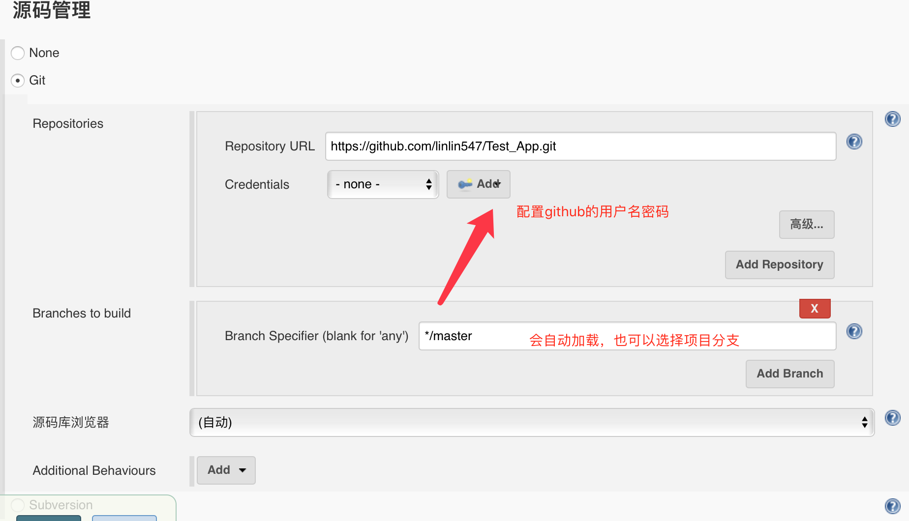
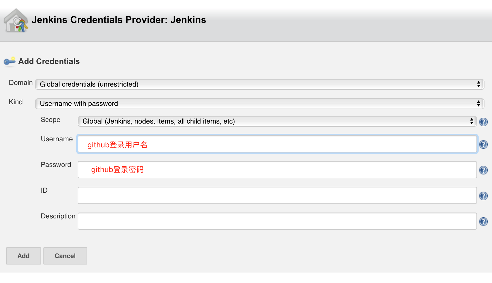
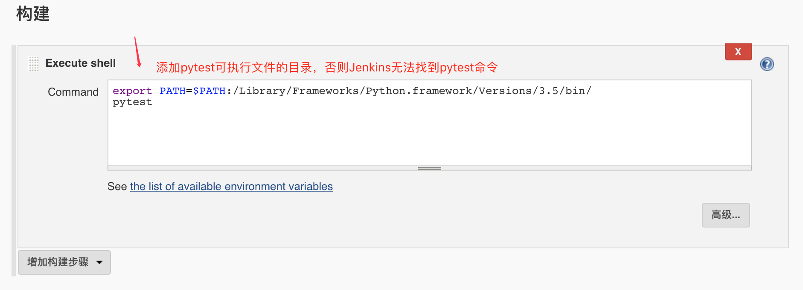
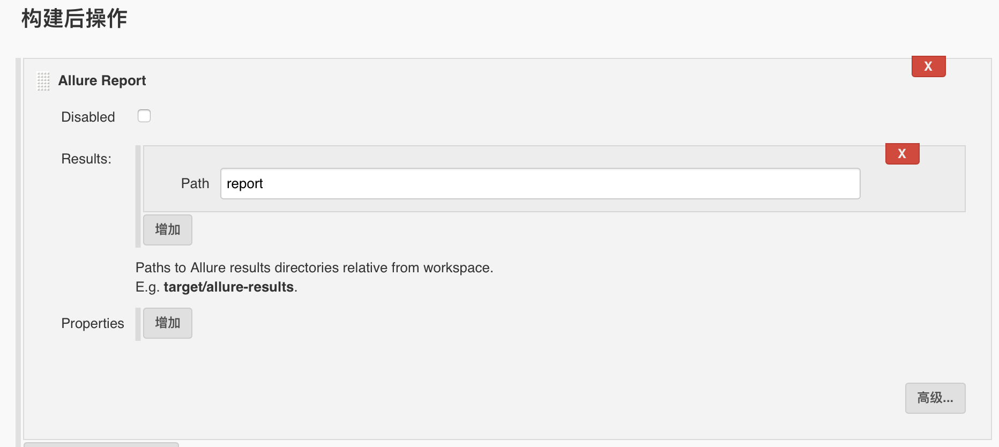
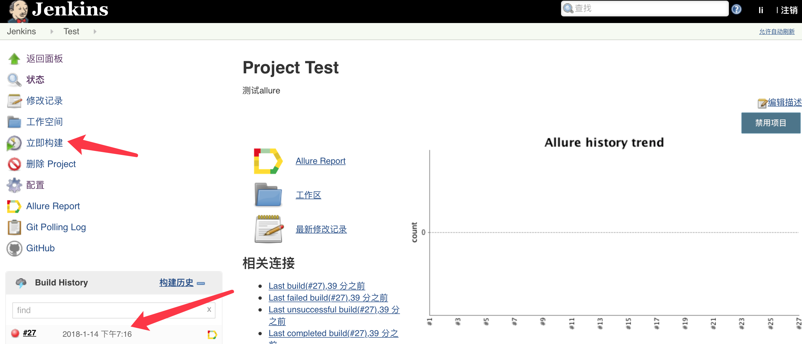
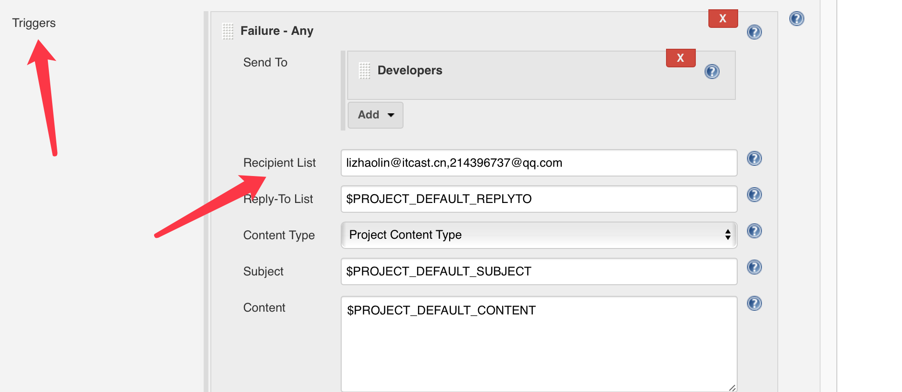

## 35.Jenkins持续集成配置

### Jenkins安装Allure插件

```
	1.进入jenkins系统管理 -> 管理插件
	2.点击可选插件
	3.搜索框输入Allure Jenkins Plugin
	4.选中安装
```
### Jenkins安装Allure Commandline工具

```
	1.进入jenkins系统管理 -> 全局工具安装
	2.找到Allure Commandline，点击Allure Commandline安装
	3.输入一个别名
	4.点击新增安装-选择解压*.ip/*.tar.gz
	5.解压目录选择已下载好的allure2.5.0.zip包所在目录(⚠️ 版本要一致)
	6.点击保存
```

### Jenkins新建一个项目

```
	1.选择新建一个自由风格的软件项目 -> 点击确定
	2.输入一些项目描述
```

```
	3.选择GitHub project 
	4.输入Project url # 因我们只是举例，所以使用自己的一个github测试脚本
	
```


### 源码管理配置

```
	5.勾选Git
	6.Repository URL输入地址同第四步
	7.点击Add添加github的用户名和密码
```



### 构建触发器

```
	8.勾选Poll SCM # 根据定时任务，查看github版本是否更新，如果更新会自动构建项目
	9.输入crontab命令
		举例：
			*/1 * * * * # 每一分钟检查一次
	10.点击增加构建步骤，选择Execute shell
	11.Command输入：
		export PATH=$PATH:"pytest可执行文件的目录"
		pytest
```


```
时程表的格式如下:
f1 f2 f3 f4 f5 program
其中 f1 是表示分钟，f2 表示小时，f3 表示一个月份中的第几日，f4 表示月份，f5 表示一个星期中的第几天。program 表示要执行的程式。
```

### 构建后操作

```
	12.点击增加构建后操作步骤，选择Allure Report
	13.Path路径输入：生成的报告文件夹名称
	⚠️ 文件夹名称与pytest生成的报告文件夹名称一致
```


## 36.触发项目构建

### 手动触发构建

- 点击立即构建

### 更新github代码

- 触发器在定时任务到达时，会出发项目构建


## 37.Jenkins邮件配置

### 发件人配置

```
	配置邮件系统用户：
		系统管理-系统设置-Jenkins Location
		系统管理员邮件地址：用户名@163.com(发送邮件用户)
	配置系统邮件：
		系统管理-系统设置-邮件通知
		SMTP服务器：例 smtp.163.com
		用户默认邮件后缀：例如 @163.com
		高级-使用SMTP认证
		输入发送邮箱和密码 -可以使用测试邮件验证
	配置(发送附件)邮件：
		系统管理-系统设置-Extended E-mail Notification
		SMTP server：例 smtp.163.com
		Default user E-mail suffix：例如 @163.com
		高级-Use SMTP Authentication - 输入发送邮件的邮箱和密码
		Default Content Type: HTML(text/html)
		Default Content(报告模版,使用以下html代码即可):
		       <hr/>(本邮件是程序自动下发的，请勿回复！)<hr/>
				项目名称：$PROJECT_NAME<br/><hr/>
				构建编号：$BUILD_NUMBER<br/><hr/>
				git版本号：${GIT_REVISION}<br/><hr/>
				构建状态：$BUILD_STATUS<br/><hr/>
				触发原因：${CAUSE}<br/><hr/>
				目录：${ITEM_ROOTDIR}<br/><hr/>
				构建日志地址：<a href=" ">${BUILD_URL}console</a ><br/><hr/>
				构建地址：<a href="$BUILD_URL">$BUILD_URL</a ><br/><hr/>
				报告地址：<a href="${BUILD_URL}allure">${BUILD_URL}allure</a ><br/><hr/>
				失败数：${FAILED_TESTS}<br/><hr/>
				成功数：${FAILED_TESTS}<br/><hr/>
				变更集：${JELLY_SCRIPT,template="html"}<br/><hr/>
```

### 收件人配置
```
	# 添加测试报告接收邮件列表

	14.点击增加构建后操作步骤，选择Editable Email Notification 
	15.点击Advanced Setting…
	16.点击Triggers中的高级按钮
	17.Recipient List输入邮件接收列表，多个邮件逗号分隔

```



## 小作业

### 元素定位和操作练习

- 点击搜索按钮
- 输入“无线”
- 获取当前有几条记录?

###滑动和拖拽时间练习

- 想办法滑动到最后的“关于手机”
- 点击进去
- 看当前页面是不是有一个“5.1”的字符串

## 常用代码

### 前置代码

```
	from appium import webdriver
	# server 启动参数
	desired_caps = {}
	# 设备信息
	desired_caps['platformName'] = 'Android'
	desired_caps['platformVersion'] = '5.1'
	desired_caps['deviceName'] = '192.168.56.101:5555'
	# app的信息
	desired_caps['appPackage'] = 'com.android.settings'
	desired_caps['appActivity'] = '.Settings'
	# 解决输入中文
	desired_caps['unicodeKeyboard'] = True
	desired_caps['resetKeyboard'] = True

	# 声明我们的driver对象
	driver = webdriver.Remote('http://127.0.0.1:4723/wd/hub', desired_caps)
```

### 获取包名

```
1.Mac/Linux: 'adb shell dumpsys window windows | grep mFocusedApp’
2.在 Windows 终端运行 'adb shell dumpsys window windows’ 然后去看mFocusedApp这一行的内容。
```

### xPath

```
//*[contains(@,'')]
```


